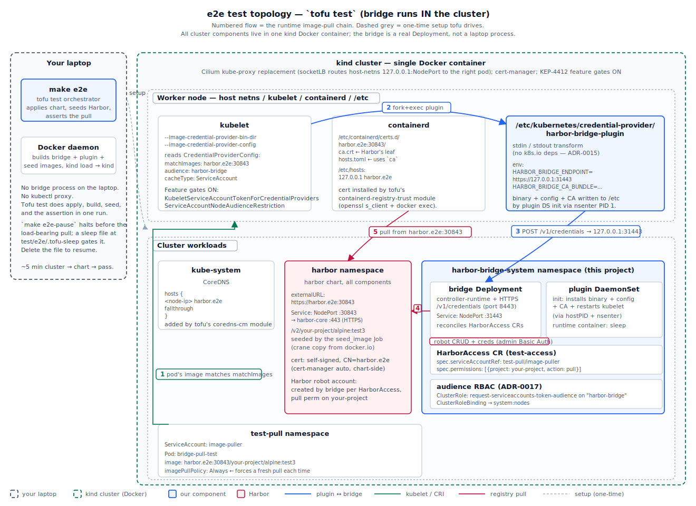
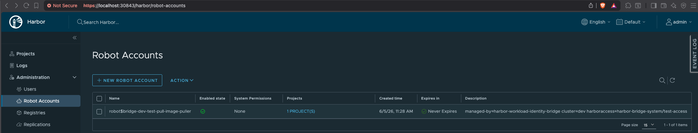
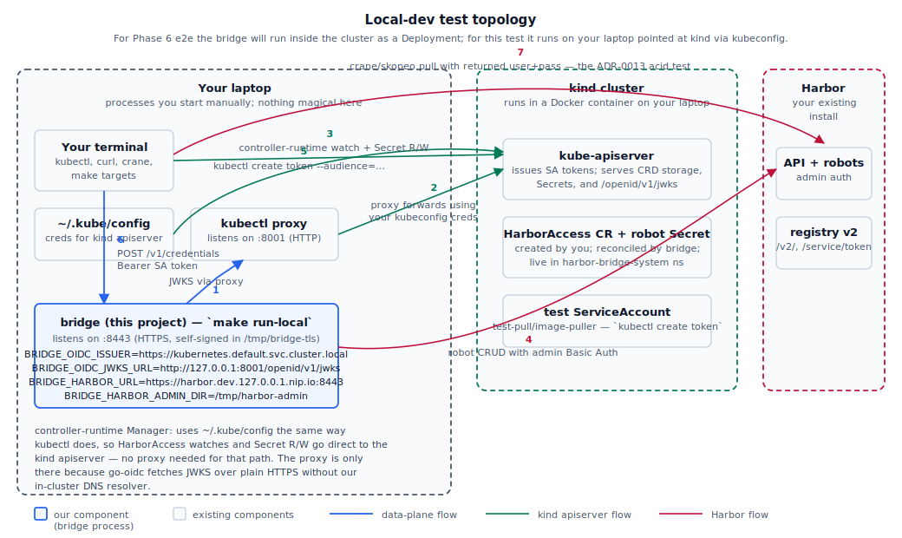

# How to test the bridge end-to-end

Two paths, pick by what you're doing.

- **§1 `tofu test`** — the recommended path. One command spins up a
  fresh kind cluster, installs Cilium + cert-manager + Harbor + the
  bridge chart, seeds a private image, and asserts the kubelet
  credential-provider chain by pulling that image. ~5 minutes
  start-to-finish. Use this for every change you'd otherwise want
  smoke-tested.

- **§2 Remote / manual cluster** — drive the bridge against your own
  pre-existing Kubernetes + Harbor by hand, without the Helm chart.
  Useful when you're iterating on the bridge binary against real
  infrastructure, or when something in your env can't be reproduced
  by the kind-based harness.

---

# §1 — `tofu test` (recommended)

## Prerequisites

- Docker
- OpenTofu ≥ 1.6 (`brew install opentofu`)
- kind on `$PATH` (`brew install kind`)
- `kubectl` for poking at the cluster while paused

The OpenTofu harness handles the rest: pulls the kind, Cilium, cert-
manager, and Harbor charts, builds the bridge + plugin + seed images
locally, loads them into the kind nodes, applies the chart, seeds the
test image, and runs the assertion pod.

## Run it

```bash
make e2e         # no pause — full run, no human in the loop
make e2e-pause   # pauses between bridge_install and pull_pod so you can poke around
```

Both end with `run "pull_pod"... pass` if the chain works end-to-end.

## Topology

Everything except `tofu test` and the local Docker daemon runs inside a
single kind cluster. The bridge is a real Deployment (not a laptop
`go run`), the plugin is on each node's filesystem (installed by the
chart's DaemonSet via `nsenter`), and Harbor is in-cluster behind a
NodePort. The numbered arrows are the runtime pull chain; the grey
dashed arrow is the one-time setup tofu drives.



## Stages, in order

Every `run` block in [`test/e2e/tests/01-bridge.tftest.hcl`](test/e2e/tests/01-bridge.tftest.hcl):

| # | Stage              | What it does |
|---|--------------------|--------------|
| 1 | `build_images`     | `docker build` bridge + plugin + seed images locally |
| 2 | `cluster`          | kind cluster with Cilium kube-proxy replacement, cert-manager, containerd config |
| 3 | `harbor`           | Harbor chart, exposed at `https://harbor.e2e:30843` |
| 4 | `containerd_trust` | Extract Harbor's TLS cert from each node, install as `/etc/containerd/certs.d/harbor.e2e:30843/ca.crt` |
| 5 | `coredns_rewrite`  | CoreDNS hosts-plugin entry so `harbor.e2e` resolves to a kind node IP cluster-wide |
| 6 | `seed_image`       | crane copy `alpine:3.20` → `harbor.e2e:30843/your-project/alpine:test3` |
| 7 | `bridge_install`   | The chart — CRDs, bridge Deployment, plugin DaemonSet, audience RBAC |
| 8 | `harbor_access`    | Apply a `HarborAccess` CR; wait on `Ready=True` |
| 9 | `file_sleep`       | No-op unless `TF_VAR_pause_before_pull=true` (see below) |
| 10 | `pull_pod`        | The load-bearing assertion: pod pulls the seeded private image |

## Pause-for-inspection mode

`make e2e-pause` sets `TF_VAR_pause_before_pull=true`. That flips the
`enabled` input on the `test-sleep` module wired between
`harbor_access` and `pull_pod`. While paused:

- A file appears at **`test/e2e/.tofu-sleep`**.
- The terraform apply blocks on a `while [ -f ... ]; do sleep 2; done`
  loop watching that file.
- The cluster is fully set up: Harbor running, chart installed,
  `HarborAccess` CR `Ready=True`, test image in Harbor, plugin on
  every node. The only thing that hasn't run yet is the assertion pod.

In another shell, poke around:

```bash
export KUBECONFIG=~/.kube/config   # kind wrote it during cluster setup
kubectl get pod -A
kubectl -n harbor-bridge-system logs deploy/harbor-bridge
kubectl -n harbor-bridge-system exec deploy/harbor-bridge -- \
  wget -qO- http://localhost:8081/metrics | grep bridge_
# manually run the pull_pod manifest, exec into it, etc.
```

### Open Harbor in your browser

The chart configures Harbor at `https://harbor.e2e:30843` — that
hostname only resolves on kind nodes and inside the cluster. To reach
the Harbor web UI from your laptop, port-forward to the harbor service:

```bash
# In another shell — leave running while you browse.
kubectl -n harbor port-forward svc/harbor 30843:443
```

Then open <https://localhost:30843/>. Your browser will warn about the
self-signed cert (CN=`harbor.e2e`, you're hitting `localhost`) — click
through. Log in as `admin`.

Retrieve the admin password the chart auto-generated:

```bash
kubectl -n harbor get secret harbor-core \
  -o jsonpath='{.data.HARBOR_ADMIN_PASSWORD}' | base64 -d
echo
```

Once logged in, the bridge-managed robot accounts show up under
**Administration → Robot Accounts** — one robot per `HarborAccess`
CR, prefixed `robot$bridge-<clusterName>-<sa-namespace>-<sa-name>`
([ADR-0003](docs/adr/0003-persistent-robots-per-harboraccess.md)),
described with the chart's managed-by tag + the originating CR
([ADR-0012](docs/adr/0012-robot-description-as-component-contract.md)):



The description column (`managed-by=harbor-workload-identity-bridge
cluster=dev harboraccess=harbor-bridge-system/test-access`) is the
cross-component contract the janitor uses to reverse-map robots to
CRs and tear down orphans — see ADR-0012.

When done:

```bash
rm test/e2e/.tofu-sleep
```

The apply unblocks, `pull_pod` runs, and the test finishes.

**Ctrl-C while paused** triggers the trap inside the sleep loop — it
removes the sleep file and exits 0, so terraform proceeds to teardown
cleanly. No orphan kind clusters.

## What's in the harness

| File / module | Role |
|---|---|
| [`test/e2e/main.tf`](test/e2e/main.tf) | Declares `pause_before_pull` variable |
| [`test/e2e/tests/01-bridge.tftest.hcl`](test/e2e/tests/01-bridge.tftest.hcl) | The test definition — every `run` block |
| [`test/e2e/modules/docker-build`](test/e2e/modules/docker-build) | `docker build` bridge + plugin + seed images |
| [`test/e2e/modules/kind-cluster`](test/e2e/modules/kind-cluster) | Kind + Cilium + cert-manager + `extra_etc_hosts` |
| [`test/e2e/modules/harbor`](test/e2e/modules/harbor) | Harbor chart + node IP / cert-extract helpers |
| [`test/e2e/modules/containerd-registry-trust`](test/e2e/modules/containerd-registry-trust) | Pulls Harbor's cert off the wire, installs into containerd |
| [`test/e2e/modules/coredns-cm`](test/e2e/modules/coredns-cm) | Patches CoreDNS `Corefile` for synthetic hostnames |
| [`test/e2e/modules/harbor-bridge-install`](test/e2e/modules/harbor-bridge-install) | The chart install |
| [`test/e2e/modules/k8s-yaml`](test/e2e/modules/k8s-yaml) | Apply YAML manifests with optional `wait` on conditions |
| [`test/e2e/modules/test-sleep`](test/e2e/modules/test-sleep) | The pause mechanism |
| [`test/e2e/modules/test-exec-pod`](test/e2e/modules/test-exec-pod) | The `pull_pod` assertion |
| [`test/e2e/seed/Dockerfile`](test/e2e/seed/Dockerfile) | curl + crane + openssl + jq image used by the seed job |

## When it fails

The CI workflow ([`.github/workflows/e2e.yml`](.github/workflows/e2e.yml))
captures kubelet logs, bridge metrics, plugin logs, and Kubernetes
events to `/tmp/diag/` on any failed stage. For local runs:

```bash
NODE=$(kubectl -n test-pull get pod bridge-pull-test -o jsonpath='{.spec.nodeName}')
docker exec "$NODE" journalctl -u kubelet --since "2 minutes ago" --no-pager \
  | grep -E "plugins.go|harbor-bridge|credential"
kubectl -n harbor-bridge-system exec deploy/harbor-bridge -- \
  wget -qO- http://localhost:8081/metrics | grep bridge_credential_issuances_total
kubectl -n harbor-bridge-system logs ds/harbor-bridge-plugin --tail=50
kubectl -n test-pull describe pod bridge-pull-test | tail -30
```

The pull errors you may hit and what they mean:

| Error | Cause |
|---|---|
| `no basic auth credentials` | Kubelet returned no creds for the image. Either matchImages didn't match, or the credential provider hit an error. Check kubelet logs for `plugin.go:416 "Failed to provide credentials"`. |
| `x509: certificate signed by unknown authority` | `containerd_trust` didn't install the Harbor cert on this node, or containerd didn't reload. `docker exec NODE cat /etc/containerd/certs.d/harbor.e2e:30843/ca.crt`. |
| `audience "X" not found in pod spec volume, system:node:N is not authorized` | Chart's audience RBAC isn't applied. Check `kubectl get clusterrole \| grep audience-token-request`. |
| `credential provider plugin did not return a valid cacheKeyType` | Bridge returning an enum value kubelet doesn't accept. Three valid values: `Image`, `Registry`, `Global`. |

---

# §2 — Remote / manual cluster

Use when you want to validate the bridge binary against a Harbor and a
Kubernetes you already have, without the Helm chart. Same architecture
as §1 but you provide the cluster and Harbor; you run the bridge as a
local `go run` against your kubeconfig; the plugin is driven by hand
through stdin/stdout.

## Topology

The bridge runs **on your laptop**, not in the cluster. The bridge's
OIDC validator wants to fetch the apiserver's JWKS, but the canonical
JWKS URL is cluster-internal (`https://kubernetes.default.svc.cluster.local/openid/v1/jwks`)
and doesn't resolve from outside a pod. `kubectl proxy` forwards
HTTP requests on your laptop to the apiserver using your kubeconfig
credentials — the bridge fetches JWKS via that proxy. The `iss` claim
the bridge expects on incoming SA tokens stays the cluster-internal
URL; only the *fetch URL* changes (the `BRIDGE_OIDC_JWKS_URL` env var).



## Prerequisites

- A running Kubernetes cluster (any flavor) with admin access via `kubectl`.
- A running Harbor with admin credentials and at least one project you
  can push to.
- `kubectl`, `jq`, `openssl`, Go 1.26+ on your laptop.
- `crane` for the registry handshake check.
  `go install github.com/google/go-containerregistry/cmd/crane@latest`.

## Phase 0 — Gather info

```bash
# Issuer the apiserver advertises in OIDC discovery — what tokens claim as iss.
kubectl get --raw /.well-known/openid-configuration | jq -r .issuer
# typically: https://kubernetes.default.svc.cluster.local

# Your Harbor base URL — must be reachable from your laptop.
echo "https://your-harbor.example.com"

# A Harbor project that exists and you can push to.
echo "your-project"
```

You also need the Harbor admin username + password.

## Phase 1 — Start the bridge

Two terminals.

### Terminal 1: kubectl proxy

```bash
make proxy
# equivalent to: kubectl proxy --port=8001
```

Leave it running for the duration of the test. Quick sanity check from
a third terminal:

```bash
curl -s http://127.0.0.1:8001/openid/v1/jwks | jq .keys[0].kid
# prints a kid (key id) — confirms the proxy reaches the apiserver
```

### Terminal 2: the bridge

```bash
kubectl apply -f config/crd/bases/harbor.aetherize.io_harboraccesses.yaml
kubectl create namespace harbor-bridge-system

# Drop Harbor admin creds where the bridge expects them.
mkdir -p /tmp/harbor-admin
printf '%s' 'admin' > /tmp/harbor-admin/username
printf '%s' 'YOUR_HARBOR_ADMIN_PASSWORD' > /tmp/harbor-admin/password
chmod 600 /tmp/harbor-admin/*

# Run the bridge.
BRIDGE_CLUSTER_NAME=dev \
BRIDGE_NAMESPACE=harbor-bridge-system \
BRIDGE_OIDC_ISSUER="$(kubectl get --raw /.well-known/openid-configuration | jq -r .issuer)" \
BRIDGE_OIDC_JWKS_URL=http://127.0.0.1:8001/openid/v1/jwks \
BRIDGE_HARBOR_URL=https://your-harbor.example.com \
BRIDGE_HARBOR_ADMIN_DIR=/tmp/harbor-admin \
BRIDGE_LOG_LEVEL=debug \
make run-local
```

What `make run-local` does for you: generates a 1-day self-signed TLS
cert in `/tmp/bridge-tls` if absent, sets `BRIDGE_TLS_CERT_FILE` /
`BRIDGE_TLS_KEY_FILE` / `BRIDGE_LISTEN_ADDR=:8443` /
`BRIDGE_HEALTH_ADDR=:8081`, and refuses to start if
`BRIDGE_OIDC_ISSUER` looks cluster-internal but `BRIDGE_OIDC_JWKS_URL`
is unset.

**Checkpoint 1.** A successful start prints (JSON-formatted):

```
"msg":"data-plane server listening","addr":":8443","mtls":false
"msg":"starting orphan-robot sweep"
"msg":"starting bridge","leader_election":false
```

## Phase 2 — Apply a HarborAccess CR

```bash
kubectl create namespace test-pull
kubectl create serviceaccount image-puller -n test-pull

cat <<'YAML' | kubectl apply -f -
apiVersion: harbor.aetherize.io/v1alpha1
kind: HarborAccess
metadata:
  name: test-access
  namespace: harbor-bridge-system
spec:
  serviceAccountRef:
    namespace: test-pull
    name: image-puller
  trustPolicy:
    issuer: https://kubernetes.default.svc.cluster.local
    audience: harbor-bridge
  permissions:
    - project: your-project
      action: pull
  tokenTTL: 1h0m0s
YAML

kubectl get harboraccess -n harbor-bridge-system test-access -o yaml -w
```

**Checkpoint 2.** Within a few seconds:

- `status.conditions[type=Ready].status=True`
- `status.robot.name = robot$bridge-dev-test-pull-image-puller`
- A Secret in the bridge namespace:
  ```bash
  kubectl get secret -n harbor-bridge-system \
    robot-harbor-bridge-system-test-access -o yaml
  ```
- In Harbor's *Administration → Robot Accounts*, a new robot named
  `bridge-dev-test-pull-image-puller`.

The control plane is now validated end-to-end against real Harbor +
real Kubernetes.

## Phase 3 — Hit the data plane with curl

```bash
TOKEN=$(kubectl create token image-puller -n test-pull \
  --audience=harbor-bridge --duration=1h)

curl -sv -k \
  -H "Authorization: Bearer $TOKEN" \
  -H "Content-Type: application/json" \
  -d '{"image":"your-harbor/your-project/whatever:tag"}' \
  https://localhost:8443/v1/credentials | jq .
```

**Checkpoint 3.** Expected response:

```json
{
  "username": "robot$bridge-dev-test-pull-image-puller",
  "password": "<long opaque string>",
  "expires_in": 3600,
  "cache_key_type": "Registry"
}
```

Save the username + password — Phase 4 needs them.

## Phase 4 — Crane handshake check (ADR-0013 acid test)

```bash
USER='robot$bridge-dev-test-pull-image-puller'
PASS='THE_PASSWORD_FROM_PHASE_3'

crane auth login your-harbor.example.com -u "$USER" -p "$PASS"
crane pull your-harbor.example.com/your-project/whatever:tag /tmp/pulled.tar
ls -lh /tmp/pulled.tar
```

**Checkpoint 4.** Crane writes a tarball ⇒ a containerd-equivalent
client took the bridge's credentials and completed Harbor's
`/service/token` handshake. ADR-0013 holds, the architectural shape
of the bridge is sound.

Common failures:

- `401 unauthorized` from `/service/token` — Harbor rejected the
  Basic Auth. Diff the password in Phase 3's response against the
  Secret in the bridge namespace (`kubectl get secret … -o jsonpath='{.data.password}' | base64 -d`).
- `403 denied` after auth — the robot doesn't have permission on the
  project. Check `spec.permissions[].project` in the HarborAccess
  matches the image's project segment exactly.

## Phase 5 — Drive the plugin by hand

```bash
make build-plugin

# Confirm the plugin is dependency-clean per ADR-0015.
go list -deps ./plugin/... | grep -cE '^(k8s\.io|sigs\.k8s\.io)'  # 0

# Same SA token, same image, through the plugin.
TOKEN=$(kubectl create token image-puller -n test-pull \
  --audience=harbor-bridge --duration=10m)

PLUGIN_RESP=$(jq -n --arg tok "$TOKEN" --arg img "your-harbor/your-project/whatever:tag" \
  '{apiVersion:"credentialprovider.kubelet.k8s.io/v1",
    kind:"CredentialProviderRequest",
    image:$img,
    serviceAccountToken:$tok}' \
  | HARBOR_BRIDGE_ENDPOINT=https://localhost:8443 \
    HARBOR_BRIDGE_CA_BUNDLE=/tmp/bridge-tls/tls.crt \
    bin/harbor-bridge-plugin)

echo "$PLUGIN_RESP" | jq .
```

**Checkpoint 5.** Response shape:

```json
{
  "apiVersion": "credentialprovider.kubelet.k8s.io/v1",
  "kind": "CredentialProviderResponse",
  "cacheKeyType": "Registry",
  "cacheDuration": "1h0m0s",
  "auth": {
    "your-harbor.example.com": {
      "username": "robot$bridge-dev-test-pull-image-puller",
      "password": "<long opaque string>"
    }
  }
}
```

Notice `cacheKeyType: "Registry"` — see [ADR-0016](docs/adr/0016-credential-provider-cache-key-type.md)
on why this is the only valid value for our credential model and how
the bridge used to emit the kubelet-invalid `"ServiceAccount"`.

## Troubleshooting

| Symptom | Likely cause | Fix |
| --- | --- | --- |
| `dial tcp: lookup kubernetes.default.svc.cluster.local: no such host` at bridge startup | `BRIDGE_OIDC_JWKS_URL` not set | Start `make proxy` and set `BRIDGE_OIDC_JWKS_URL=http://127.0.0.1:8001/openid/v1/jwks`. |
| Reconciler logs `create robot: NOT_FOUND: project "X" not found` and the CR is `Ready=False` | Harbor project from `spec.permissions[].project` doesn't exist | Create the project in Harbor; the next reconcile recovers. |
| Bridge returns `401 invalid token` from `/v1/credentials` | SA token's `iss` claim ≠ `BRIDGE_OIDC_ISSUER` | Re-print the issuer with `kubectl get --raw /.well-known/openid-configuration` and align both env var + `trustPolicy.issuer`. |
| `/v1/credentials` returns `403 no matching HarborAccess` | SA subject mismatch OR audience mismatch | Compare `kubectl get sa image-puller -n test-pull` subject to CR's `serviceAccountRef`. Compare token's `--audience` to `trustPolicy.audience`. |
| `/v1/credentials` returns `503 credentials not yet available` | Robot Secret hasn't materialised | `kubectl get harboraccess -n harbor-bridge-system test-access -o yaml` until `Ready=True`. |
| Reconciler logs `tls: failed to verify certificate` against Harbor | Harbor's cert signed by a CA your system trust store doesn't know | Trust Harbor's CA at the OS level, or use a Harbor with a publicly-trusted cert. `BRIDGE_HARBOR_CA_FILE` is on the backlog. |
| `crane pull` 401 from Harbor | Wrong creds, or robot's password rotated between Phase 3 and 4 | Re-run Phase 3, use the fresh password. |
| `kubectl proxy` exits with `error: error upgrading connection` | Background job got SIGHUP or kubeconfig context changed | Restart `make proxy` and re-fetch JWKS to confirm health. |

## What §2 doesn't cover

The full kubelet → plugin → bridge → containerd → Harbor chain with a
real kubelet doing the fork+exec. That's exactly what §1 (`tofu test`)
exists for — run that.
