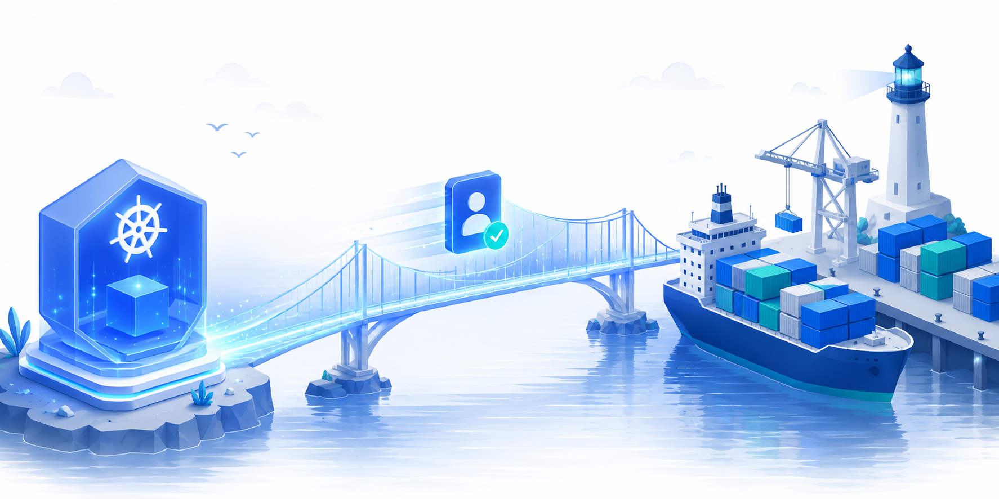
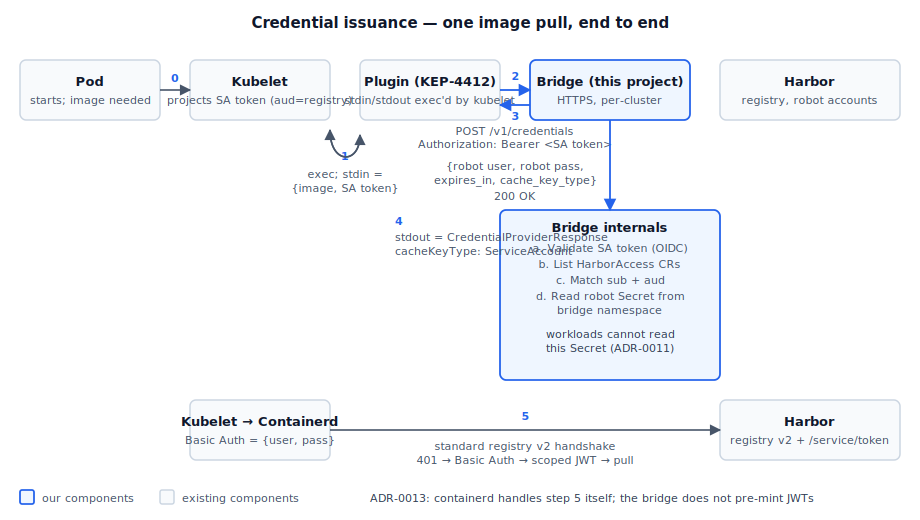
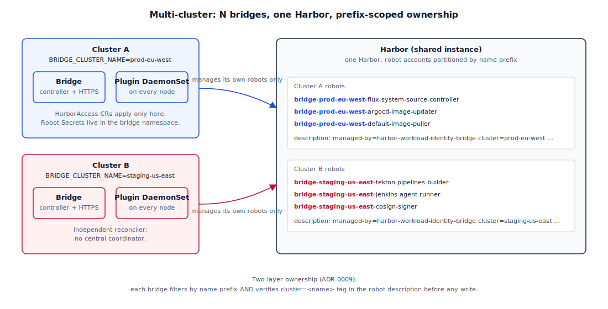

<p align="center">
  
</p>

# Harbor Workload Identity Bridge

**Pull from Harbor with the Service Account your pod is already running as. No
imagePullSecrets, no long-lived credentials in workload namespaces, no
per-namespace token-distribution chores.**

<p align="center">
  <a href="LICENSE"></a>
  <a href="https://github.com/AetherizeGmbH/harbor-workload-identity-bridge/releases"></a>
  <a href="https://github.com/AetherizeGmbH/harbor-workload-identity-bridge/actions/workflows/test.yml"></a>
  
  <a href="https://github.com/goharbor/harbor/issues/17520"></a>
</p>

> Status: **alpha — Phases 1 through 6 complete, end-to-end verified
> on kind v1.35 + Harbor 2.x**. `make e2e` brings up a fresh kind
> cluster, installs Harbor + the chart, seeds a private image, and
> the load-bearing `pull_pod` assertion passes: kubelet exec's the
> plugin, the plugin reaches the bridge over a NodePort, the bridge
> mints/serves a Harbor robot's Basic Auth credentials, containerd
> completes Harbor's bearer-token handshake itself, and the image
> pulls. See [HOW-TO-TEST.md §1](HOW-TO-TEST.md).

---

## The problem

Pulling from a private registry in Kubernetes still works the way it
did in 2016. The operational cost grows linearly with the cluster:

- An `imagePullSecret` lives in every namespace that pulls. 200
  namespaces × 3 Harbor projects = 600 Secrets to provision and
  remember.
- Each Secret holds a long-lived robot password. Any pod in that
  namespace can `kubectl exec` and `cat /run/secrets/…` to lift the
  credentials. Namespace-as-boundary doesn't survive a compromised
  pod, and the credential it lifts is the same one every other
  workload in the namespace uses.
- Rotation requires touching every namespace at once. Many teams
  defer this and end up with credentials older than the cluster.
- Onboarding a new workload is a Secret-provisioning ticket: name
  the Secret, document it, attach it to the right Service Account,
  hope it doesn't drift.

Cloud-managed registries (ECR, GCR, ACR) sidestep this through
[KEP-4412](https://github.com/kubernetes/enhancements/issues/4412):
kubelet exec's a credential-provider plugin per pull, the plugin
authenticates the **workload** by its Service Account token, and the
returned credentials never touch the workload's namespace.

Harbor doesn't have this yet. [goharbor/harbor#17520](https://github.com/goharbor/harbor/issues/17520)
tracks the upstream OIDC trust-policy work. Once it lands, the
standard SA-token → registry flow will work natively with Harbor.
**This project is the bridge in between.**

## What changes operationally

For the operator:

- **Zero imagePullSecrets.** Workload namespaces hold no Harbor
  credentials. A compromised pod has nothing to exfiltrate.
- **One declarative `HarborAccess` CR per Service Account.** Lives
  in git, lives in the bridge's namespace, reviewable as code.
  Onboarding a new workload is one CR commit.
- **Robots scoped per Service Account.** Two SAs in the same
  namespace get two robots with separate Harbor projects. Least
  privilege replaces the over-broad namespace-wide secret.
- **One rotation point.** The bridge rotates every robot's password
  every 24h. The whole cluster's blast-radius window is 24h, no
  matter how many namespaces.
- **New nodes self-provision.** The plugin DaemonSet installs the
  binary, config, and CA on every new node and patches kubelet. No
  node-image rebuilds, no cloud-init scripts to ship.
- **Auditable end-to-end.** Every credential issuance logs the SA
  subject, audience, image, and matching HarborAccess CR. Prometheus
  metrics break out by result (`ok` / `unauthorized` / `forbidden`
  / `unavailable`).

For the workload:

- The pod runs as a Service Account; it pulls. No volume mounts to
  manage, no `imagePullSecrets` array to maintain, no credentials in
  `kubectl describe pod`.

## What the project ships

- A `HarborAccess` CRD: *"this Service Account in this cluster gets
  these permissions on these Harbor projects."*
- A controller that materialises each CR into a persistent Harbor
  robot account, rotates its password every 24h, and tears it down
  when the CR is deleted.
- A small HTTPS server that the kubelet plugin asks for credentials
  per pull. SA token in, robot Basic Auth credentials out.
- A KEP-4412 credential-provider plugin binary — a stateless adapter
  between kubelet's stdin/stdout protocol and the bridge's HTTPS API
  ([ADR-0015](docs/adr/0015-plugin-duplicates-wire-types.md)).
- A Helm chart that installs both: bridge as a Deployment in the
  release namespace, plugin as a DaemonSet that copies the binary +
  kubelet config + bridge CA onto every node's filesystem. Required
  values fail-fast with action-oriented errors at template time.

When upstream Harbor lands #17520, you delete the HTTPS server and
the plugin; the CRD and reconciler survive as a thin declarative
layer. This is the same shape ExternalDNS and cert-manager have to
their respective backends.

## How it works



For every image pull, the kubelet runs the plugin, which calls the bridge
with the pod's SA token. The bridge validates the token's signature,
expiry, and issuer locally; finds the `HarborAccess` whose
`serviceAccountRef` and `trustPolicy.audience` match the token; reads the
robot's Basic Auth credentials from a Secret in the bridge's own
namespace; and returns them.

The kubelet then hands those credentials to containerd, which does the
**standard Harbor handshake itself** — the same `401 →
WWW-Authenticate: Bearer → POST /service/token → scoped JWT → pull`
dance that containerd does for every registry. The bridge does not
pre-mint JWTs. (See [ADR-0013](docs/adr/0013-return-robot-basic-auth-credentials.md)
for why earlier iterations got this wrong.)

## Multi-cluster, by design

Many clusters can share one Harbor. Each cluster runs its own bridge;
there is no central coordinator. Robots are name-prefixed
`bridge-<cluster-name>.<sa-namespace>.<sa-name>` so the prefix
`bridge-<cluster-name>.` is the ownership boundary.



The `.` delimiter makes the name injective and makes the ownership prefix
collision-free across clusters (`bridge-prod.` is not a prefix of
`bridge-prod-eu.…`), so there is no "cluster names must not be hyphen-prefixes
of each other" operator burden. A defense-in-depth tag in the robot's Harbor
description (`cluster=<name>`) backs the prefix check. See
[ADR-0018](docs/adr/0018-dot-delimited-naming.md) for the naming scheme and
[ADR-0009](docs/adr/0009-multi-cluster-topology.md) for the full ownership
model.

## Security model

Short version: the robot password is in a Kubernetes Secret in the
bridge's own namespace, not in your workload's namespace. Workloads have
no RBAC path to read it. It enters kubelet/containerd memory for the
duration of a pull and never lands on disk in the workload's pod. The
reconciler rotates it every 24h, bounding the blast radius if a node is
ever compromised.

That's materially better than `imagePullSecrets`. It is not
perfect — there's a 24h window after compromise, and containerd does
touch the password in memory. The full threat model, including what
the bridge does *not* defend against, is in [SECURITY.md](SECURITY.md).

## Quickstart

Prerequisites: a Kubernetes cluster (v1.34+ for KEP-4412 beta), a Harbor
instance with admin credentials, cert-manager installed, Helm 3+.

```bash
# 1. Pre-create the admin-creds Secret (the chart does not — your
#    Harbor admin password should never live in values.yaml).
kubectl create namespace harbor-bridge-system
kubectl create secret generic harbor-admin -n harbor-bridge-system \
  --from-literal=username=admin \
  --from-literal=password=YOUR_HARBOR_ADMIN_PASSWORD

# 2. Point cert-manager at an Issuer that signs the bridge's TLS cert.
#    Self-signed is fine for evaluation:
cat <<'YAML' | kubectl apply -f -
apiVersion: cert-manager.io/v1
kind: ClusterIssuer
metadata: { name: harbor-bridge-ca }
spec: { selfSigned: {} }
YAML

# 3. Install the chart from the ghcr.io OCI registry.
#    (Need Helm >= 3.8; OCI is enabled by default since 3.9.)
#
# About `plugin.audience`: the string kubelet writes into the `aud`
# claim of the SA token it sends to the bridge. Every HarborAccess
# CR's `spec.trustPolicy.audience` must match this value, or the
# bridge rejects the token. Pick one string per cluster and embed
# the cluster name so a leaked token from cluster A can't be replayed
# against cluster B (both sharing the same Harbor). Convention:
# `harbor-bridge-<clusterName>`. The chart auto-generates the
# Kubernetes RBAC kubelet needs to mint this audience (see ADR-0017).
helm install harbor-bridge \
  oci://ghcr.io/aetherizegmbh/charts/harbor-workload-identity-bridge \
  --version 0.3.3 \
  -n harbor-bridge-system \
  --set clusterName=prod-eu-west \
  --set harbor.url=https://harbor.example.com \
  --set harbor.adminCredsSecret.name=harbor-admin \
  --set plugin.audience=harbor-bridge-prod-eu-west \
  --set 'plugin.matchImages={harbor.example.com}' \
  --set tls.issuerRef.name=harbor-bridge-ca

# IMPORTANT: matchImages does NOT support globs in the path. Use the
# bare host (or host:port) form — `harbor.example.com` matches every
# image from that registry; `harbor.example.com/*` is a literal `/*`
# path prefix and will never match.

# (Or from a clone of this repo:
#    helm install harbor-bridge ./charts/harbor-bridge -n harbor-bridge-system \
#      ... --set flags as above ...)

# 4. The chart's plugin DaemonSet does the kubelet wiring for you:
#    init container `nsenter`s into PID 1, patches /etc/default/kubelet
#    with --image-credential-provider-{bin-dir,config}, and runs
#    `systemctl restart kubelet`. Once per node, idempotency-guarded.
#    Expect a brief node-local kubelet bounce as the DaemonSet rolls
#    out (control-plane static pods recover within seconds).
#    Set `plugin.patchKubelet=false` when the node image already wires
#    kubelet (EKS / GKE / AKS, baked AMIs).

# 5. Apply a HarborAccess CR. The audience MUST match plugin.audience above.
cat <<'YAML' | kubectl apply -f -
apiVersion: harbor.aetherize.io/v1alpha1
kind: HarborAccess
metadata:
  name: flux-access
  namespace: harbor-bridge-system
spec:
  serviceAccountRef:
    namespace: flux-system
    name: source-controller
  trustPolicy:
    issuer: https://kubernetes.default.svc.cluster.local
    audience: harbor-bridge-prod-eu-west
  permissions:
    - project: production
      action: pull
  tokenTTL: 1h0m0s   # canonical Go time.Duration form — see ADR-0016 §test fixtures
YAML
```

Within a few seconds a `bridge-prod-eu-west.flux-system.source-controller`
robot appears in Harbor's admin UI, the bridge namespace gets a
`robot-harbor-bridge-system.flux-access` Secret, and pods running as
`flux-system/source-controller` can pull from `harbor.example.com/production/*`.

**Testing.** Two paths in [HOW-TO-TEST.md](HOW-TO-TEST.md):

- **§1 `tofu test` (recommended)** — `make e2e` brings up a fresh
  kind cluster, installs Harbor + the chart, seeds a private image,
  asserts the pull end-to-end. `make e2e-pause` halts before the
  load-bearing pull so you can `kubectl` around the cluster. ~5 min.
- **§2 Remote / manual cluster** — drive the bridge as a `go run`
  process against an existing Kubernetes + Harbor by hand, with
  `kubectl proxy` for OIDC discovery. Useful when iterating on the
  bridge binary against real-world infra.

### Helm upgrade caveat — kubelet restart on config changes

The chart's idempotency guard only checks whether `/etc/default/kubelet`
already has the credential-provider flags; it does **not** detect when
the *config file content* changes (e.g. you change `plugin.matchImages`,
`plugin.audience`, or rotate the bridge CA). Kubelet reads the
credential-provider config **once at boot** — there is no hot reload
(`DynamicKubeletConfig` was removed in 1.26). So after a `helm upgrade`
that changes anything in the config file, you must restart kubelet on
each node manually so the new content takes effect:

```bash
# After a helm upgrade that changed matchImages / audience / TLS:
for node in $(kubectl get nodes -o name); do
  docker exec ${node##*/} systemctl restart kubelet   # kind
  # or: ssh ${node##*/} sudo systemctl restart kubelet
done
```

A future chart version should make the idempotency content-aware (hash
the config file and compare); for now this is operator-driven. The
DaemonSet itself rolls fresh pods on `helm upgrade` (annotation
checksums force a re-roll) — that updates the files on disk — but the
init container's restart check shortcuts because the flags are still
present in `/etc/default/kubelet`.

## Architecture and decisions

- [`docs/PHASES.md`](docs/PHASES.md) — what is done, what is next, what
  is intentionally out of scope. Written to survive context compaction;
  read this first when resuming work.
- [`HOW-TO-TEST.md`](HOW-TO-TEST.md) — reproducible end-to-end procedure
  with local bridge, kubectl proxy, and a manual plugin-driver round-trip.
- [`docs/adr/`](docs/adr/) — every load-bearing design decision has an
  ADR. The ones most likely to surprise you:
  - [ADR-0002](docs/adr/0002-bridge-control-plane-data-plane-split.md) —
    control plane and data plane live in one binary but in separate
    packages. The data plane is deletable as a single PR when Harbor
    #17520 lands.
  - [ADR-0009](docs/adr/0009-multi-cluster-topology.md) — multi-cluster
    ownership model and the prefix-collision operator caveat.
  - [ADR-0011](docs/adr/0011-robot-password-secret-storage.md) — why
    the robot Secret lives in the bridge namespace, not the CR's
    namespace.
  - [ADR-0013](docs/adr/0013-return-robot-basic-auth-credentials.md) —
    why we return Basic Auth credentials instead of pre-minting Docker
    bearer JWTs.
  - [ADR-0014](docs/adr/0014-harbor-robot-dollar-prefix-handling.md) —
    Harbor's `robot$` prefix asymmetry between POST and GET.
  - [ADR-0015](docs/adr/0015-plugin-duplicates-wire-types.md) — why
    the plugin defines its own wire types instead of importing
    `k8s.io/kubelet` or `bridge/dataplane`. (Mechanised via
    `make verify-plugin-isolation`.)
  - [ADR-0016](docs/adr/0016-credential-provider-cache-key-type.md) —
    the bridge emits `cacheKeyType: Registry`, not the often-confused
    `ServiceAccount` (which is a *kubelet-side* tokenAttributes enum,
    not a CredentialProviderResponse value). Fixes a bug that masked
    as a kubelet silent-abort.
  - [ADR-0017](docs/adr/0017-chart-provisions-audience-rbac.md) — the
    chart ships a ClusterRole + Binding granting `system:nodes` the
    `request-serviceaccounts-token-audience` verb on
    `plugin.audience`. Required since v1.32 default-on of
    `ServiceAccountNodeAudienceRestriction`; without it kubelet's
    `TokenRequest` for the credential provider silently fails.

## Harbor compatibility

The bridge talks to one Harbor surface only — the robot-account API under
`/api/v2.0` (create/list/get/update/delete + secret refresh). The supported
range is **tested, not asserted** ([ADR-0020](docs/adr/0020-harbor-compatibility-matrix.md)):
the `harbor-compat` CI workflow runs the full kubelet-driven pull chain
(`make e2e HARBOR_CHART_VERSION=<chart>`) against each version below weekly and
on demand, then auto-PRs the result into the table. **Floor** is the lowest
version whose run is green (bounded by the system-level robot + secret-refresh
endpoints the reconciler needs); **ceiling** is the newest we've run. Minor
versions between two tested rows are inferred from the unchanging endpoint
contract, not individually run.

<!-- BEGIN HARBOR-COMPAT (generated by .github/workflows/harbor-compat.yml — do not edit by hand) -->

| Harbor | Chart | Tested | Last run (UTC) |
| --- | --- | --- | --- |
| 2.15.1 (ceiling) | 1.19.1 | ✅ | 2026-07-20 |
| 2.13.5 | 1.17.5 | ✅ | 2026-07-20 |
| 2.11.2 | 1.15.2 | ✅ | 2026-07-20 |
| 2.9.5 (floor) | 1.13.5 | ✅ | 2026-07-20 |

<!-- END HARBOR-COMPAT -->

## Status and roadmap

### Shipped

| Phase | What | State |
| --- | --- | --- |
| 1 | Scaffolding, CRD types, ADRs 0001–0008 | ✅ Complete |
| 2 | Control plane: config, Harbor client, reconciler, janitor, ADRs 0009–0012 | ✅ Complete |
| 3 | Data plane: OIDC validator, HTTP handler, HTTPS server, metrics, cmd/main.go, ADR-0013 pivot | ✅ Complete |
| 4 | Plugin binary (KEP-4412 stdin/stdout protocol), ADR-0015 | ✅ Complete |
| 5 | Helm chart (bridge + plugin DaemonSet + cert-manager + kubelet config) | ✅ Complete |
| 6 | Kubelet-driven e2e + SECURITY.md polish + v0.1.0 tag | ✅ E2E passes end-to-end (`make e2e`); only the `v0.1.0` tag itself is outstanding |
| 7 | Harbor compatibility matrix — parameterised e2e + `harbor-compat` CI + auto-PR'd table, ADR-0020 | ✅ Mechanism shipped; table auto-fills on the first matrix run |

### Next

In order.

1. **Plugin installation on managed clusters.** The DaemonSet
   `nsenter`s into PID 1 and patches `/etc/default/kubelet` (see the
   upgrade caveat above). That fits self-managed nodes. On EKS, GKE,
   and AKS the node image already wires the credential-provider
   directory and kubelet config, so patching breaks them. Add install
   modes for those three that drop the binary, config, and CA without
   touching kubelet. Separately, hash the on-disk config so a `helm
   upgrade` changing `matchImages`, `audience`, or the CA re-applies
   instead of shortcutting the idempotency guard.

2. **Label-selected `HarborAccess` CRs.** A bridge owns every
   `HarborAccess` in its namespace. Add a label selector so one
   cluster can run several bridges at once, each reconciling only the
   CRs it matches: one bridge per Harbor, or one per team. The selector
   joins the `bridge-<cluster>.` robot prefix as part of the ownership
   boundary, so two bridges never touch the same robot.

3. **Other registries via a backend plugin.** Move the Harbor-specific
   code behind a translation layer so the CRD, reconciler, and data
   plane no longer depend on Harbor, then add a Nexus backend. The flow
   takes an SA token in and returns scoped credentials, which holds for
   any registry; only account provisioning and the credential handshake
   differ. It reuses the control-plane and data-plane split
   ([ADR-0002](docs/adr/0002-bridge-control-plane-data-plane-split.md)),
   with the backend as a third seam.

## Support and services

The project is Apache-2.0 and free to run. If your team is wrestling
with Harbor robot sprawl, unclear namespace-to-image ownership, or wants
to move to workload identity but doesn't know where to start, Aetherize
offers a free one-hour audit. We walk through your current setup with
you and draft a plan to clean it up. Email
[contact@aetherize.com](mailto:contact@aetherize.com). Paid engagement
covers implementation, migration, and ongoing operation.

## Contributing

File an issue or a PR if you've found a bug or want to discuss the design. Any
non-trivial change ships with an ADR.

## License

Apache 2.0. Full text in [LICENSE](LICENSE); attribution requirements in
[NOTICE](NOTICE); every source file carries an `SPDX-License-Identifier`
header.
