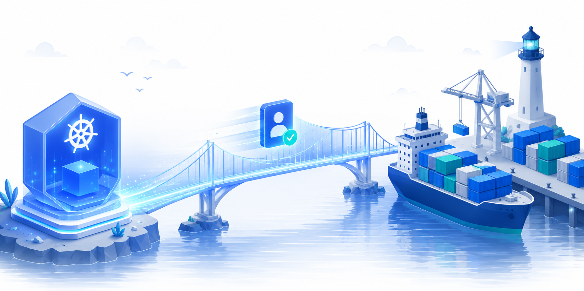
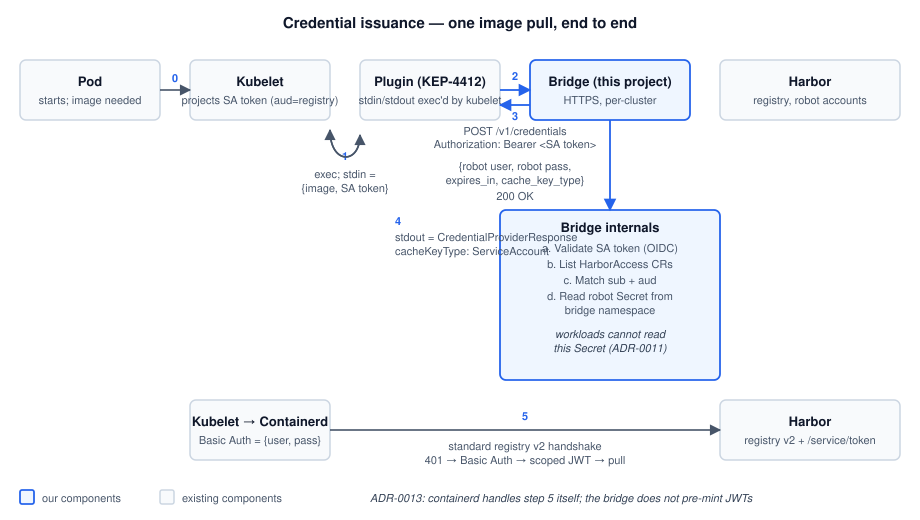
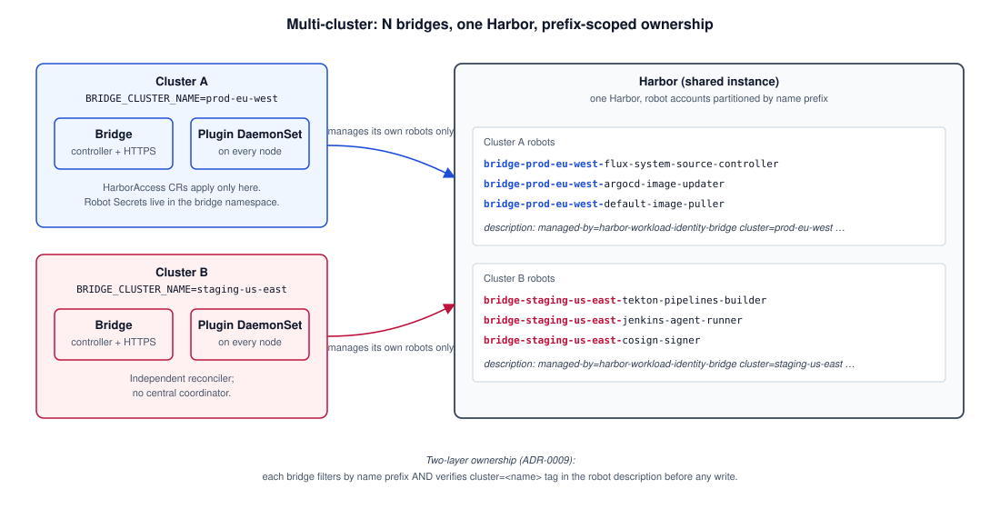

<p align="center">
  
</p>

# Harbor Workload Identity Bridge

**Pull from Harbor with the Service Account your pod is already running as. No
imagePullSecrets, no long-lived credentials in workload namespaces, no
per-namespace token-distribution chores.**

<p align="center">
  <a href="LICENSE"></a>
  <a href="https://github.com/AetherizeGmbH/harbor-workload-identity-bridge/releases"></a>
  <a href="https://github.com/AetherizeGmbH/harbor-workload-identity-bridge/actions/workflows/test.yml"></a>
  
  <a href="https://github.com/goharbor/harbor/issues/17520"></a>
</p>

> Status: **alpha — Phases 1 through 10 shipped (see [Status and
> roadmap](#status-and-roadmap)), end-to-end verified on kind (Kubernetes
> v1.37) + Harbor 2.x**. `make e2e` brings up a fresh kind
> cluster, installs Harbor + the chart, seeds a private image, and
> the load-bearing `pull_pod` assertion passes: kubelet exec's the
> plugin, the plugin reaches the bridge over a NodePort, the bridge
> mints/serves a Harbor robot's Basic Auth credentials, containerd
> completes Harbor's bearer-token handshake itself, and the image
> pulls. See [HOW-TO-TEST.md §1](HOW-TO-TEST.md).

---

## The problem

Pulling from a private registry in Kubernetes still works the way it
did in 2016. The operational cost grows linearly with the cluster:

- An `imagePullSecret` lives in every namespace that pulls. 200
  namespaces × 3 Harbor projects = 600 Secrets to provision and
  remember.
- Each Secret holds a long-lived robot password. Any pod in that
  namespace can `kubectl exec` and `cat /run/secrets/…` to lift the
  credentials. Namespace-as-boundary doesn't survive a compromised
  pod, and the credential it lifts is the same one every other
  workload in the namespace uses.
- Rotation requires touching every namespace at once. Many teams
  defer this and end up with credentials older than the cluster.
- Onboarding a new workload is a Secret-provisioning ticket: name
  the Secret, document it, attach it to the right Service Account,
  hope it doesn't drift.

Cloud-managed registries (ECR, GCR, ACR) sidestep this through
[KEP-4412](https://github.com/kubernetes/enhancements/issues/4412):
kubelet exec's a credential-provider plugin per pull, the plugin
authenticates the **workload** by its Service Account token, and the
returned credentials never touch the workload's namespace.

Harbor doesn't have this yet. [goharbor/harbor#17520](https://github.com/goharbor/harbor/issues/17520)
tracks the upstream OIDC trust-policy work. Once it lands, the
standard SA-token → registry flow will work natively with Harbor.
**This project is the bridge in between.**

## What changes operationally

For the operator:

- **Zero imagePullSecrets.** Workload namespaces hold no Harbor
  credentials. A compromised pod has nothing to exfiltrate.
- **One declarative `HarborAccess` CR per Service Account.** Lives
  in git, lives in the bridge's namespace, reviewable as code.
  Onboarding a new workload is one CR commit.
- **Robots scoped per Service Account.** Two SAs in the same
  namespace get two robots with separate Harbor projects. Least
  privilege replaces the over-broad namespace-wide secret.
- **One rotation point.** The bridge rotates every robot's password
  every 24h, without breaking a single cached credential (kubelet is
  never told to cache past the next rotation). The whole cluster's
  blast-radius window is 24h, no matter how many namespaces. A
  `HarborAccess` the bridge refuses (wrong audience or issuer, invalid
  spec) gets its robot disabled in Harbor and its Secret deleted until it
  is fixed; fixing it re-enables the robot with a new password
  ([ADR-0030](docs/adr/0030-refused-harboraccess-suspends-its-robot.md)).
- **Revocation you can rely on.** Editing a `HarborAccess` changes the
  robot's grants in Harbor on the next reconcile (and reverts edits made
  in the Harbor UI); pointing it at another ServiceAccount or deleting it
  deletes the old robot. Nothing with a valid password is left behind.
- **New nodes self-provision.** The plugin DaemonSet installs the
  binary, config, and CA on every new node and patches kubelet. No
  node-image rebuilds, no cloud-init scripts to ship.
- **Auditable end-to-end.** Every credential issuance logs the SA
  subject, audience, image, and matching HarborAccess CR. Prometheus
  metrics break out by result (`ok` / `unauthorized` / `forbidden`
  / `unavailable`).

For the workload:

- The pod runs as a Service Account; it pulls. No volume mounts to
  manage, no `imagePullSecrets` array to maintain, no credentials in
  `kubectl describe pod`.

## What the project ships

- A `HarborAccess` CRD: *"this Service Account in this cluster gets
  these permissions on these Harbor projects."*
- A controller that materialises each CR into a persistent Harbor
  robot account, rotates its password every 24h, and tears it down
  when the CR is deleted.
- A small HTTPS server that the kubelet plugin asks for credentials
  per pull. SA token in, robot Basic Auth credentials out.
- A KEP-4412 credential-provider plugin binary — a stateless adapter
  between kubelet's stdin/stdout protocol and the bridge's HTTPS API
  ([ADR-0015](docs/adr/0015-plugin-duplicates-wire-types.md)).
- A Helm chart that installs both: bridge as a Deployment in the
  release namespace, plugin as a DaemonSet that copies the binary +
  kubelet config + bridge CA onto every node's filesystem. Required
  values fail-fast with action-oriented errors at template time. Nodes
  that get the plugin another way (Talos system extension, baked images)
  set `plugin.enabled=false` — see
  [docs/install-external-plugin.md](docs/install-external-plugin.md) and
  [docs/platforms.md](docs/platforms.md).
  With trust-manager installed, `plugin.namespace` moves the privileged
  DaemonSet into a namespace of its own, so the bridge namespace can
  enforce Pod Security `restricted` (ADR-0027).

When upstream Harbor lands #17520, you delete the HTTPS server and
the plugin; the CRD and reconciler survive as a thin declarative
layer. This is the same shape ExternalDNS and cert-manager have to
their respective backends.

## How it works



For every image pull, the kubelet runs the plugin, which calls the bridge
with the pod's SA token. The bridge validates the token's signature,
expiry, and issuer locally, and requires it to be bound to a pod and to
live no longer than an hour (by default), as kubelet's tokens do
([ADR-0028](docs/adr/0028-token-lifetime-cap-and-pod-binding.md)); finds
the `HarborAccess` whose `serviceAccountRef` and `trustPolicy.audience`
match the token; reads the robot's Basic Auth credentials from a Secret in
the bridge's own namespace; and returns them.

The kubelet then hands those credentials to containerd, which does the
**standard Harbor handshake itself** — the same `401 →
WWW-Authenticate: Bearer → POST /service/token → scoped JWT → pull`
dance that containerd does for every registry. The bridge does not
pre-mint JWTs. (See [ADR-0013](docs/adr/0013-return-robot-basic-auth-credentials.md)
for why earlier iterations got this wrong.)

## Multi-cluster, by design

Many clusters can share one Harbor. Each cluster runs its own bridge;
there is no central coordinator. Robots are name-prefixed
`bridge-<cluster-name>.<sa-namespace>.<sa-name>` so the prefix
`bridge-<cluster-name>.` is the ownership boundary.



The `.` delimiter makes the name injective and makes the ownership prefix
collision-free across clusters (`bridge-prod.` is not a prefix of
`bridge-prod-eu.…`), so there is no "cluster names must not be hyphen-prefixes
of each other" operator burden. A defense-in-depth tag in the robot's Harbor
description (`cluster=<name>`) backs the prefix check. See
[ADR-0018](docs/adr/0018-dot-delimited-naming.md) for the naming scheme and
[ADR-0009](docs/adr/0009-multi-cluster-topology.md) for the full ownership
model.

## Security model

Short version: the robot password is in a Kubernetes Secret in the
bridge's own namespace, not in your workload's namespace. Workloads have
no RBAC path to read it. It enters kubelet/containerd memory for the
duration of a pull and never lands on disk in the workload's pod. The
reconciler rotates it every 24h, bounding the blast radius if a node is
ever compromised.

That's materially better than `imagePullSecrets`. It is not
perfect — there's a 24h window after compromise, and containerd does
touch the password in memory. The full threat model, including what
the bridge does *not* defend against, is in [SECURITY.md](SECURITY.md).

## Quickstart

Prerequisites: a Kubernetes cluster (v1.34+ for KEP-4412 beta), a Harbor
instance with admin credentials, cert-manager installed, Helm 3+.

```bash
# 1. Pre-create the admin-creds Secret (the chart does not — your
#    Harbor admin password should never live in values.yaml).
kubectl create namespace harbor-bridge-system
kubectl create secret generic harbor-admin -n harbor-bridge-system \
  --from-literal=username=admin \
  --from-literal=password=YOUR_HARBOR_ADMIN_PASSWORD

# 2. Point cert-manager at an Issuer that signs the bridge's TLS cert.
#    Self-signed is fine for evaluation, but not with bridge.mTLS: the
#    plugin's client certificates need a CA issuer whose CA is the
#    bridge's ca.crt (see bridge.mTLS.clientIssuerRef in values.yaml).
cat <<'YAML' | kubectl apply -f -
apiVersion: cert-manager.io/v1
kind: ClusterIssuer
metadata: { name: harbor-bridge-ca }
spec: { selfSigned: {} }
YAML

# 3. Install the chart from the ghcr.io OCI registry.
#    (Need Helm >= 3.8; OCI is enabled by default since 3.9.)
#
# About `plugin.audience`: the string kubelet writes into the `aud`
# claim of the SA token it sends to the bridge. Every HarborAccess
# CR's `spec.trustPolicy.audience` must match this value, or the
# bridge rejects the token. Pick one string per cluster and embed
# the cluster name so a leaked token from cluster A can't be replayed
# against cluster B (both sharing the same Harbor). Convention:
# `harbor-bridge-<clusterName>`. The chart auto-generates the
# Kubernetes RBAC kubelet needs to mint this audience (see ADR-0017).
helm install harbor-bridge \
  oci://ghcr.io/aetherizegmbh/charts/harbor-workload-identity-bridge \
  --version 0.11.5 \
  -n harbor-bridge-system \
  --set clusterName=prod-eu-west \
  --set harbor.url=https://harbor.example.com \
  --set harbor.adminCredsSecret.name=harbor-admin \
  --set plugin.audience=harbor-bridge-prod-eu-west \
  --set 'plugin.matchImages={harbor.example.com}' \
  --set tls.issuerRef.name=harbor-bridge-ca

# IMPORTANT: matchImages does NOT support globs in the path. Use the
# bare host (or host:port) form — `harbor.example.com` matches every
# image from that registry; `harbor.example.com/*` is a literal `/*`
# path prefix and will never match.

# (Or from a clone of this repo:
#    helm install harbor-bridge ./charts/harbor-bridge -n harbor-bridge-system \
#      ... --set flags as above ...)

# 4. The chart's plugin DaemonSet wires kubelet for you (ADR-0021).
#    The default `plugin.install.mode=auto` inspects the live kubelet:
#    on managed nodes (EKS / GKE / AKS) whose node image already runs
#    kubelet with --image-credential-provider-* flags, it MERGES our
#    provider entry into the existing config (foreign providers are
#    preserved); on self-managed nodes (kind, kubeadm) it PATCHES the
#    environment file the kubelet unit reads (/etc/default/kubelet, or
#    /etc/sysconfig/kubelet with RPM packages), preserving your
#    KUBELET_EXTRA_ARGS. Either
#    way kubelet restarts once per node when — and only when — the
#    effective config content changed, and the installer verifies it
#    came back healthy; running containers survive the restart.
#    `plugin.install.mode=none` drops files only (you own the kubelet
#    flags; least privilege — no hostPID, no privileged pod).
#    Talos, k3s, RKE2: see docs/platforms.md. Bottlerocket and GKE
#    Autopilot are unsupported.

# 5. Apply a HarborAccess CR. The audience MUST match plugin.audience above.
cat <<'YAML' | kubectl apply -f -
apiVersion: harbor.aetherize.io/v1alpha1
kind: HarborAccess
metadata:
  name: flux-access
  namespace: harbor-bridge-system
spec:
  serviceAccountRef:
    namespace: flux-system
    name: source-controller
  trustPolicy:
    issuer: https://kubernetes.default.svc.cluster.local
    audience: harbor-bridge-prod-eu-west
  permissions:
    - project: production
      action: pull
  tokenTTL: 1h0m0s   # canonical Go time.Duration form (kubernetes_manifest-friendly)
YAML
```

Within a few seconds a `bridge-prod-eu-west.flux-system.source-controller`
robot appears in Harbor's admin UI, the bridge namespace gets a
`robot-harbor-bridge-system.flux-access` Secret, and pods running as
`flux-system/source-controller` can pull from `harbor.example.com/production/*`.

**Testing.** Two paths in [HOW-TO-TEST.md](HOW-TO-TEST.md):

- **§1 `tofu test` (recommended)** — `make e2e` brings up a fresh
  kind cluster, installs Harbor + the chart (two bridge replicas),
  seeds private images, and asserts pulls end-to-end — then edits and
  deletes HarborAccess objects and checks in Harbor that grants changed,
  the old identity is refused, and no robot is left behind. It also
  checks that the bridge refuses ServiceAccount tokens not bound to a
  pod or living longer than an hour (ADR-0028).
  `make e2e-pause` halts after the assertions so you can `kubectl`
  around the populated cluster. ~15 min.
- **§2 Remote / manual cluster** — drive the bridge as a `go run`
  process against an existing Kubernetes + Harbor by hand, with
  `kubectl proxy` for OIDC discovery. Useful when iterating on the
  bridge binary against real-world infra.
- **GKE (`make e2e-gke`)** — same flow on a real GKE cluster, proving
  `install.mode=auto` → merge on managed nodes and that GKE's own
  Artifact Registry provider survives the merge (ADR-0022). Creates
  **billed** resources in `$GOOGLE_PROJECT`; never runs in CI.

### Uninstalling

Delete your `HarborAccess` objects **before** `helm uninstall`. Each one
the bridge serves carries a finalizer that revokes its Harbor robot, and
only a running bridge can release it — after the bridge is gone, deleting
those objects (or their namespaces) waits forever. If that already
happened, reinstall the bridge, or remove its finalizer by hand and delete
the leftover `robot$bridge-<clusterName>.*` robots in Harbor. The
finalizer is `harbor.aetherize.io/robot`, or, for a bridge with
`bridge.harborAccessSelector`, `harbor.aetherize.io/robot-<instance>`
(`bridge.instance`, default the release name; ADR-0026); the chart's
NOTES print the right one. An object that existed before the selector
was set may carry both: then remove both. Helm keeps the CRD (`crds/`); delete
it yourself when you are done.

Changing `bridge.harborAccessSelector` or `bridge.instance` later: a bridge
that gains a selector releases the shared finalizer from the objects it
served, including those that stop matching. Removing the selector leaves
`harbor.aetherize.io/robot-<instance>` on existing objects; the bridge
releases it only when `BRIDGE_INSTANCE` still names the instance, which
the chart sets only together with a selector. A renamed instance never
releases the old `harbor.aetherize.io/robot-<old instance>`. An object an
older bridge refused or found in `RobotConflict` carries the shared
finalizer without having been served; if it stops matching a new
selector, the finalizer stays (upgrade first: the bridge releases it from
refused objects it still selects). Remove such finalizers by hand once the
objects are served under the new settings.

`helm uninstall` removes nothing on the nodes. The provider entry named
`plugin.providerName` stays in kubelet's credential-provider config, and
the plugin binary with its record (`<providerName>.entry`), the CA (and
mTLS) files, the state file, the lock files and the `.bak` copies the installer keeps of every file it
replaced stay on disk. Kubelet keeps running the plugin for its
`matchImages`; with the bridge gone the plugin fails and adds no
credentials, so those pulls go ahead with whatever other credentials
apply (a later service on the same NodePort would also need a
certificate from the pinned CA to receive a token). Renaming
`plugin.providerName` leaves the old entry behind in the same way. To
clean a node:

1. Remove the entry from the config kubelet reads
   (`--image-credential-provider-config`; in patch and none mode
   `<plugin.hostConfigDir>/credential-provider-config.yaml`). Kubelet
   refuses a config without providers: if it was the last entry, also
   remove the two `--image-credential-provider-*` flags (patch mode:
   from `KUBELET_EXTRA_ARGS` in `/etc/default/kubelet`, or
   `/etc/sysconfig/kubelet` with RPM packages).
2. Restart kubelet (`systemctl restart kubelet`). Do this before you
   delete the binary: kubelet does not start while an entry's binary is
   missing.
3. Delete `<bin-dir>/<providerName>` and its record
   `<bin-dir>/<providerName>.entry`, the CA and mTLS files in
   `plugin.hostConfigDir` and the state file in `plugin.install.stateDir`
   (file names in [Several installs per cluster](#several-installs-per-cluster-adr-0029)),
   each with its `.bak` copy. The binary's `.bak` is an earlier plugin
   binary, executable, in kubelet's bin dir.
4. Once the last install is gone from the node, also delete the backups
   of the shared files (`<provider config>.bak`; in patch mode
   `/etc/default/kubelet.bak` or `/etc/sysconfig/kubelet.bak`) and the
   lock files:
   `/run/harbor-bridge-installer.lock` and a `<config>.lock` next to
   every provider config an installer edited or checked, also in a pass
   it refused: next to the cloud's config in merge mode, and in patch
   mode next to the chart-owned config and next to any config kubelet
   read before patch mode moved it.

### How the node install works — modes and upgrades (ADR-0021)

The DaemonSet runs the `harbor-bridge-installer` binary on every node.
`plugin.install.mode` selects how kubelet gets wired:

| Mode | What it does | When |
| --- | --- | --- |
| `auto` (default) | Reads the live kubelet command line: flags present → `merge`, absent → `patch`. Flags that this install's own last patch-mode pass set (its state file says so) → `patch`, which moves kubelet when `plugin.hostBinaryDir` or `plugin.hostConfigDir` changed. While other installs that have not moved yet share the old directories, it stays there and also puts its files into the new ones; kubelet moves in the pass of the last of them (ADR-0035) | Almost always the right choice |
| `merge` | Injects our provider entry into the node's **existing** `CredentialProviderConfig` (JSON or YAML — EKS/GKE/AKS formats both work; foreign providers and unknown fields round-trip untouched) and drops the binary into the existing bin dir. Kubelet flags untouched. | Managed nodes (EKS AL2023, GKE, AKS) |
| `patch` | Own dirs (`plugin.hostBinaryDir`/`hostConfigDir`) plus a parse-merge of the environment file the kubelet unit reads (`/etc/default/kubelet`, or `/etc/sysconfig/kubelet` with RPM packages; ADR-0034) — operator-set `KUBELET_EXTRA_ARGS` are preserved | Self-managed nodes: kind, kubeadm (systemd kubelet whose unit reads one of the two files) |
| `none` | Files only; you own the kubelet flags. No hostPID, no privileged container, no host-root mount | k3s/RKE2 (flags via their kubelet args), strict-privilege environments |
| `plugin.enabled=false` | No DaemonSet at all; NOTES print the provider entry to install | Talos (system extension), baked node images |

Kubelet reads the credential-provider config **once at boot** (no hot
reload), but execs the plugin *binary* per pull. The installer therefore
restarts kubelet exactly when the effective config content (or the
kubelet flags) changed — tracked via a content hash in
`/var/lib/harbor-bridge/installer-state.json` on each node (one state
file per install, see below):

- `helm upgrade` changing `matchImages`/`audience` **converges without
  operator action** (the DaemonSet re-rolls, the installer detects the
  content change, kubelet restarts once per node; running containers
  are unaffected).
- No-op re-rolls, plugin binary updates, and CA/mTLS rotation never
  restart kubelet (the plugin re-reads the CA on every exec; the
  DaemonSet's long-running container syncs rotated certs to the node).
- A value kubelet rejects no longer keeps the node down until someone
  repairs it, but it still costs an outage. The installer refuses a
  provider entry kubelet would exit on (`matchImages`,
  `defaultCacheDuration`, the audience) before it writes anything. When
  kubelet still does not come back after the restart (or, in patch mode,
  runs without the flags), the installer waits out its verification
  timeout (90 s), restores the files it replaced, restarts kubelet onto
  them and fails the pod with the reason. Kubelet is down for about that
  time, longer than the node-monitor grace period (40 s, 50 s since
  Kubernetes 1.32): the node turns `NotReady` and its pods drop out of
  Service endpoints until kubelet runs again. The installer does not
  restart kubelet onto the same content again: roll out corrected values,
  change kubelet (an upgraded binary, or another command line or
  `--config` file, gets one more try by itself), or fix the node and
  delete the state file there to retry (ADR-0033).

### Several installs per cluster (ADR-0029)

A cluster can run several bridges, for example one per Harbor instance
([ADR-0026](docs/adr/0026-audience-pinning-and-harboraccess-selector.md)).
Each is a Helm release with a release name and a namespace of its own
and its own plugin DaemonSet. Kubelet has one credential-provider config
and one bin dir, so the releases share them: on every node, each
release's installer adds and updates only the provider entry named by
its `plugin.providerName` and leaves every other entry alone: the other
releases' and the cloud's. Values for a second release
(`helm install harbor-bridge-eu … --namespace harbor-bridge-eu --create-namespace`)
next to a first one that keeps the default provider name:

```yaml
clusterName: prod-eu-west-2          # distinct when both bridges use the same Harbor
plugin:
  providerName: harbor-bridge-eu     # kubelet entry and binary name; unique per release
  audience: harbor-bridge-prod-eu-west-2
  matchImages: ["harbor-eu.example.com"]   # must not overlap the other release's
bridge:
  harborAccessSelector:              # give every release a selector, and label
    harbor.aetherize.io/bridge: harbor-eu  # each HarborAccess for its bridge
service:
  nodePort: 31444                    # the first release keeps 31443
```

- **A release name per release.** The release name names the chart's
  cluster-scoped objects (the RBAC for the kubelet audience and, with
  `plugin.namespace`, the trust-manager Bundle), the plugin's mTLS client
  CN and, by default, `bridge.instance`, which names the bridge's
  finalizer. Two releases with the same name, even in different
  namespaces, collide. `fullnameOverride` replaces the release name in
  the object names and the CN, but `bridge.instance` follows only the
  release name: whenever `fullnameOverride` is what tells two releases
  apart, set `bridge.instance` explicitly too.
- **A namespace per release.** Install each release into a namespace of
  its own. The bridge's leader-election Lease has a fixed name
  (`bridge.harbor.aetherize.io`) in the release namespace, so two bridges
  there elect one leader between them and the other bridge's control
  plane does not run (leader election is on with the default two
  replicas). Each bridge's janitor also lists the robot Secrets of its
  `clusterName` in its namespace and deletes those whose HarborAccess its
  selector does not match: two bridges with the same `clusterName` (on
  different Harbors) in one namespace delete each other's Secrets.
- **A plugin namespace per release, or one created outside Helm.** With
  `plugin.namespace`, give each release its own, or create a shared one
  yourself and set `plugin.createNamespace=false` on every release.
  Otherwise the first release owns the Namespace object, installing the
  next one fails on it, and uninstalling the first deletes it together
  with the other releases' plugin DaemonSets.
- **Selectors on every release.** A bridge without
  `bridge.harborAccessSelector` sees every HarborAccess and marks the
  other bridge's objects `AudienceMismatch`. Label each HarborAccess for
  its bridge and give each release a selector.
- **Node files.** The default name keeps `harbor-bridge-plugin`,
  `harbor-bridge-ca.crt` (`harbor-bridge-client.crt`/`.key` with mTLS)
  and `installer-state.json`. Any other name uses `<name>` in the bin
  dir, `<name>.ca.crt` (`<name>.client.crt`/`.key`) in
  `plugin.hostConfigDir` and `<name>.installer-state.json` in
  `plugin.install.stateDir`. Every install also keeps a record of its
  entry next to its binary, `<name>.entry` (`harbor-bridge-plugin.entry`
  for the default name, mode `0600`).
- **Upgrade first, chart and plugin image.** Every release on the
  cluster must run a chart version with ADR-0029 **and a plugin image
  with its installer** before you add the second. The installer runs from
  `plugin.image` (`plugin.image.tag`, which defaults to the chart's
  version, or `plugin.image.digest`): a release that pins an older tag or
  digest keeps the older installer after the chart upgrade. With the
  default provider name, an older installer in patch or none mode
  rewrites the shared config with only its own entry, takes no locks and
  writes no record, so the other installs drop its entry in turn. With a
  non-default `plugin.providerName`, an older installer stops before it
  touches the node: the install container fails with
  `read rendered credential-provider config: open /config/credential-provider-config.yaml: no such file or directory`,
  the pods stay in `Init:CrashLoopBackOff`, and nothing changes on the
  node until the release gets a plugin image with ADR-0029. Add the
  second release only once every existing release's plugin DaemonSet
  runs such an image on every node, that is, once
  `kubectl -n <plugin namespace> rollout status daemonset/<fullname>-plugin`
  has finished for each (`<fullname>` is the release name or
  `fullnameOverride`). From then on, never roll a release back to a chart
  or plugin image before ADR-0029 while another release's plugin is on
  the nodes. (A single install can roll back: the installer keeps its
  state file readable for older installers, so an unchanged config does
  not restart kubelet.)
- **Same directories.** In patch and none mode all releases must use the
  same `plugin.hostBinaryDir` and `plugin.hostConfigDir`. Patch mode
  refuses to point kubelet at other directories while the config kubelet
  reads holds another release's entry (in a chart-owned config, only an
  entry that release's record in kubelet's bin dir vouches for), unless
  that release has its binary and record in the new bin dir and its
  entry in the new config already. To change the directories of all
  releases, change them in each, in auto mode: each release's pass puts
  its files into the new directories and keeps kubelet on the old ones,
  and the last one moves kubelet (ADR-0035). In auto
  mode a later release merges into whatever config kubelet already runs,
  and its binary goes into kubelet's bin dir. When that config is another release's
  chart-owned config, it treats it as the chart's (see "The chart-owned
  config stays the chart's" below). Otherwise keep kubelet's config out
  of every `plugin.hostConfigDir`: the installer refuses a kubelet config
  inside its own `plugin.hostConfigDir` that is not the chart-owned one,
  and a `plugin.install.configFile` inside it. Never make
  `plugin.hostConfigDir` kubelet's config directory (Kubernetes 1.34+):
  kubelet loads every config file of it, which every sync container can
  add and no pass removes.
- **Shared CA and mTLS files.** Each release keeps its CA file and its
  mTLS client certificate and key in `plugin.hostConfigDir`, and every
  release's sync container mounts that directory read-write as root. Where
  releases share it (always in patch and none mode), a compromised sync
  container of one release can read the other releases' mTLS client keys
  and replace their pinned CA until their own sync container restores it
  (every 60 s). That breaks the other release's pulls, and, together with
  a position on the path to its bridge's endpoint, lets the attacker
  impersonate that bridge; the token check still applies. In auto or
  merge mode a `plugin.hostConfigDir` per release avoids this
  (SECURITY.md). Per-release directories must be disjoint: never the
  same as, inside, or containing another release's
  `plugin.hostConfigDir`, `plugin.hostBinaryDir`, `plugin.install.binDir`
  or `plugin.install.stateDir`, or kubelet's credential-provider bin dir.
  `/etc/kubernetes/credential-provider-config/eu` under the default
  directory, for example, is in reach of the default release's sync
  container, which can read the CA and mTLS key there and replace the
  directory with a symlink. The installer refuses a symlink in its own
  `plugin.hostConfigDir`'s path, but kubelet follows one when it mounts
  the directory into a `none`-mode install container and every sync
  container, and the chart and the installer compare only one release's
  own directories.
- **Disjoint `matchImages`.** Kubelet runs every provider whose
  `matchImages` match an image, pools their credentials and tries them
  in order until a pull succeeds (read in the kubelet source; see
  ADR-0029). Overlapping patterns still pull, but every pull calls each
  matching bridge, and a bridge without a HarborAccess for the pod
  answers 403 and logs a denial each time.
- **Concurrent rollouts are safe.** The installers serialise on
  `/run/harbor-bridge-installer.lock` and on a `.lock` file next to the
  provider config, and each restarts kubelet only for changes to its own
  entry.
- **The chart-owned config stays the chart's.** In patch and none mode
  each pass rewrites `<plugin.hostConfigDir>/credential-provider-config.yaml`
  to its own entry plus the other releases' entries, and drops anything
  else, as the single install always did. It keeps another release's
  entry only when that release's binary and its record, holding exactly
  that entry, are in kubelet's bin dir (`plugin.hostBinaryDir`), which
  the sync containers cannot write. A merge pass into such a config (its
  own, or one another release's record names) does the same. That keeps
  every installer from writing or keeping a planted or changed entry,
  not kubelet from reading one: kubelet reads the file whenever it
  starts, so a sync container that swaps its own version in before a
  kubelet start, including the restart an installer triggers right after
  its write, gets its entries run (SECURITY.md; open decision O6). Keep
  `plugin.hostBinaryDir` for this chart's plugins only; the chart
  refuses a `plugin.hostBinaryDir` or `plugin.install.stateDir` in reach
  of `plugin.hostConfigDir`.
- **The installer refuses names it does not own**: in a cloud's config
  (merge mode), a provider entry of that name that is not a bridge
  entry; for a non-default name, a file of that name in kubelet's bin
  dir that is not this plugin (GKE keeps kubelet itself there) and has
  no record of this install next to it. In a cloud's config it also
  refuses to write or restart kubelet onto a config kubelet would exit
  on: an entry whose binary is missing from kubelet's bin dir or not
  executable, a repeated name, or a name kubelet refuses. A refused pass
  changes no config, binary, record, CA, mTLS or state file; only lock
  files (see [Uninstalling](#uninstalling)) may be new.
- Removing one release, or renaming its provider, leaves its entry on
  the nodes: see [Uninstalling](#uninstalling).

### Bootstrap ordering (chicken-and-egg)

The plugin can only run after its own image was pulled — so the bridge
and plugin images must come from a registry that `plugin.matchImages`
does **not** cover (the public GHCR images satisfy this by default).
The chart fails at template time if an exact `matchImages` entry equals
the images' registry host; air-gapped mirrors that accept the bootstrap
ordering can override with `plugin.allowSelfMatchImages=true`. A bridge
outage only affects *new* pulls of matched images: running containers
need no registry credentials, and kubelet's credential cache (per
ServiceAccount and registry, for each HarborAccess's `spec.tokenTTL`,
shortened to the robot's next scheduled password rotation) serves new
pulls by the same ServiceAccount on that node until it expires.
`plugin.defaultCacheDuration` does not set it: kubelet uses that value
only for a plugin response without a cache duration, and the plugin
always sends one.

## Architecture and decisions

- [`docs/PHASES.md`](docs/PHASES.md) — historical build log of Phases
  1–6 (May–June 2026), kept for the reasoning behind early choices. It
  is not maintained: for current behaviour read the ADRs below,
  [SECURITY.md](SECURITY.md) and [MIGRATION.md](MIGRATION.md).
- [`HOW-TO-TEST.md`](HOW-TO-TEST.md) — reproducible end-to-end procedure
  with local bridge, kubectl proxy, and a manual plugin-driver round-trip.
- [`docs/adr/`](docs/adr/) — every load-bearing design decision has an
  ADR. The ones most likely to surprise you:
  - [ADR-0002](docs/adr/0002-bridge-control-plane-data-plane-split.md) —
    control plane and data plane live in one binary but in separate
    packages. The data plane is deletable as a single PR when Harbor
    #17520 lands.
  - [ADR-0009](docs/adr/0009-multi-cluster-topology.md) — multi-cluster
    ownership model (its prefix-collision caveat was retired by
    [ADR-0018](docs/adr/0018-dot-delimited-naming.md)).
  - [ADR-0011](docs/adr/0011-robot-password-secret-storage.md) — why
    the robot Secret lives in the bridge namespace, not the CR's
    namespace.
  - [ADR-0013](docs/adr/0013-return-robot-basic-auth-credentials.md) —
    why we return Basic Auth credentials instead of pre-minting Docker
    bearer JWTs.
  - [ADR-0014](docs/adr/0014-harbor-robot-dollar-prefix-handling.md) —
    Harbor's `robot$` prefix asymmetry between POST and GET.
  - [ADR-0015](docs/adr/0015-plugin-duplicates-wire-types.md) — why
    the plugin defines its own wire types instead of importing
    `k8s.io/kubelet` or `bridge/dataplane`. (Mechanised via
    `make verify-plugin-isolation`.)
  - [ADR-0016](docs/adr/0016-credential-provider-cache-key-type.md) —
    the bridge emits `cacheKeyType: Registry`, not the often-confused
    `ServiceAccount` (which is a *kubelet-side* tokenAttributes enum,
    not a CredentialProviderResponse value). Fixes a bug that masked
    as a kubelet silent-abort.
  - [ADR-0017](docs/adr/0017-chart-provisions-audience-rbac.md) — the
    chart ships a ClusterRole + Binding granting `system:nodes` the
    `request-serviceaccounts-token-audience` verb on
    `plugin.audience`. Required since v1.32 default-on of
    `ServiceAccountNodeAudienceRestriction`; without it kubelet's
    `TokenRequest` for the credential provider silently fails.
  - [ADR-0021](docs/adr/0021-node-installer-modes.md) — the Go node
    installer and its `auto`/`merge`/`patch`/`none` modes; content-hash
    restart policy (kubelet restarts only on real config changes);
    why merge round-trips foreign providers as `map[string]any`.
    (Mechanised via `make verify-installer-isolation`.)
  - [ADR-0022](docs/adr/0022-gke-e2e-harness.md) — the GKE e2e harness:
    Artifact Registry image delivery, sslip.io + LoadBalancer instead
    of DNS surgery, and the AR-coexistence assertion that pins merge
    mode's "don't break the cloud's own provider" guarantee.

## Harbor compatibility

The bridge talks to one Harbor surface only — the robot-account API under
`/api/v2.0` (create/list/get/update/delete + secret refresh). The supported
range is **tested, not asserted** ([ADR-0020](docs/adr/0020-harbor-compatibility-matrix.md)):
the `harbor-compat` CI workflow runs the full kubelet-driven pull chain
(`make e2e HARBOR_CHART_VERSION=<chart>`) against each version below weekly and
on demand, then auto-PRs the result into the table. **Floor** is the lowest
version whose run is green (bounded by the system-level robot + secret-refresh
endpoints the reconciler needs); **ceiling** is the newest we've run. Minor
versions between two tested rows are inferred from the unchanging endpoint
contract, not individually run.

<!-- BEGIN HARBOR-COMPAT (generated by .github/workflows/harbor-compat.yml — do not edit by hand) -->

| Harbor | Chart | Tested | Last run (UTC) |
| --- | --- | --- | --- |
| 2.15.2 (ceiling) | 1.19.2 | ✅ | 2026-09-28 |
| 2.13.5 | 1.17.5 | ✅ | 2026-09-28 |
| 2.11.2 | 1.15.2 | ✅ | 2026-09-28 |
| 2.9.5 (floor) | 1.13.5 | ✅ | 2026-09-28 |

<!-- END HARBOR-COMPAT -->

## Status and roadmap

### Shipped

| Phase | What | State |
| --- | --- | --- |
| 1 | Scaffolding, CRD types, ADRs 0001–0008 | ✅ Complete |
| 2 | Control plane: config, Harbor client, reconciler, janitor, ADRs 0009–0012 | ✅ Complete |
| 3 | Data plane: OIDC validator, HTTP handler, HTTPS server, metrics, cmd/main.go, ADR-0013 pivot | ✅ Complete |
| 4 | Plugin binary (KEP-4412 stdin/stdout protocol), ADR-0015 | ✅ Complete |
| 5 | Helm chart (bridge + plugin DaemonSet + cert-manager + kubelet config) | ✅ Complete |
| 6 | Kubelet-driven e2e + SECURITY.md polish + v0.1.0 tag | ✅ Complete; `v0.1.0` tagged, later releases cut by semantic-release ([CHANGELOG.md](CHANGELOG.md)) |
| 7 | Harbor compatibility matrix — parameterised e2e + `harbor-compat` CI + auto-PR'd table, ADR-0020 | ✅ Complete; the weekly runs fill the table above |
| 8 | Cloud-agnostic node install: Go installer with `auto`/`merge`/`patch`/`none` modes, content-hash kubelet restarts, optional plugin (Talos), GKE e2e harness, ADRs 0021, 0022 and 0024 | ✅ Code + kind e2e complete; first `make e2e-gke` run against a real project still outstanding |
| 9 | Lifecycle hardening: level-triggered robot convergence, rotation-safe caching, complete revocation, HA data plane, ADRs 0023 and 0025 | ✅ Code + kind e2e (lifecycle stages) complete |
| 10 | Security review: one audience and label-selected HarborAccess objects per bridge, optional plugin namespace, audit log and rate limit, https to Harbor, token lifetime cap and pod binding, several chart-managed installs per cluster (configurable plugin provider name), refused HarborAccess objects suspend their robots, finalizer ownership, robot names Harbor accepts, Harbor client and data plane hardening, graceful shutdown and real readiness, signed releases with provenance, gosec and fuzzing, ADRs 0026–0032, [threat model](docs/threat-models/harbor-workload-identity-bridge.md) | ✅ Complete; threat-model re-approval pending (see [Open decisions](#open-decisions-todo)) |

### Next

In order.

1. **Run the GKE e2e against a real project.** The harness exists
   (`make e2e-gke`, ADR-0022) but has not been executed yet — the first
   run validates the merge-mode runtime findings (GKE provider config
   path/format, containerd `config_path`, loopback NodePort under
   Dataplane V2) and folds them back into ADR-0022. EKS/AKS harnesses
   can follow the same module split.

2. **Other registries via a backend plugin.** Move the Harbor-specific
   code behind a translation layer so the CRD, reconciler, and data
   plane no longer depend on Harbor, then add a Nexus backend. The flow
   takes an SA token in and returns scoped credentials, which holds for
   any registry; only account provisioning and the credential handshake
   differ. It reuses the control-plane and data-plane split
   ([ADR-0002](docs/adr/0002-bridge-control-plane-data-plane-split.md)),
   with the backend as a third seam.

### Open decisions (TODO)

The single list of decisions the maintainer still has to take, from the
2026-09 security review and the ADRs since (the threat model's open items
O1, O2, O4 and O6 among them). Each item names the options and what it
limits today.

#### Threat model

- [ ] **Re-approve the threat model.** It is `Status: proposed` again:
  the closure of O3 (ADR-0028, #121: T1, T2, A5), the closure of O5 with
  the T9 change and the not yet rated T17 (ADR-0029, #130), the
  mitigations of #134 and #135, and the corrections of 2026-09-28 (T1,
  T4, T7, T16, logged events, A4) await review. *Options:* rate T17 and
  approve, or send items back. *Limits now:* the approved baseline of
  2026-09-24 no longer describes the code; nothing functional.
- [ ] **Plugin namespace split by default (O1, ADR-0027).** By default the
  privileged plugin DaemonSet runs in the release namespace, so write
  access to that namespace equals root on every node (T11);
  `plugin.namespace` (needs trust-manager) moves it out. *Options:* make
  the split the default in a future major release, or keep it opt-in.
  *Limits now:* in the default layout the release namespace must allow
  privileged pods and be restricted like cluster-admin.
- [ ] **mTLS client identity (O2).** With mTLS on, the bridge accepts any
  client certificate its CA signed; with a shared ClusterIssuer, anyone who
  may create cert-manager Certificates can get one. *Options:* a dedicated
  client CA plus an identity check, and whether mTLS should be on by
  default. *Limits now:* nothing functional; mTLS is optional defense in
  depth, and every request still needs a valid, audience-bound
  ServiceAccount token.
- [ ] **Repository settings (O4).** Required review and CODEOWNERS, secret
  scanning and push protection, private vulnerability reporting, the
  release App's ruleset bypass, and the "Dependabot alerts: read"
  permission the Renovate App lacks are GitHub settings, not code.
  *Options:* enable each, or record why not. *Limits now:* the supply-chain
  residual (T15) stays Medium.
- [ ] **CA and mTLS files out of the sync containers' reach (O6,
  ADR-0029, #130).** Every release's sync container mounts
  `plugin.hostConfigDir` read-write as root; it holds kubelet's
  chart-owned config (patch and none mode) and every release's CA pin and
  mTLS key. A compromised sync container can swap its own config in right
  before a kubelet start, and so redirect another release's pods' tokens,
  and can read other releases' mTLS keys and replace their CA pins
  (SECURITY.md, T17). *Options:* a directory per release for the CA and
  mTLS files that only that release's sync container mounts, with the
  config in a directory only installers mount; it moves the CA file every
  entry names, so the upgrade restarts kubelet once per node and install.
  Or accept the risk. *Limits now:* with one release per node, only that
  release's own sync container can do this, to its own pulls; with several
  releases sharing `plugin.hostConfigDir` (always in patch and none mode),
  any release's sync container can redirect another release's tokens and
  read its mTLS key.

#### Data plane

- [ ] **Per-source rate limit behind SNAT.** The credential endpoint's
  token bucket is keyed by the TCP peer (`bridge/dataplane/ratelimit.go`).
  With the Service's default `externalTrafficPolicy: Cluster` a node's
  NodePort usually SNATs callers to that node's address, so anyone who can
  reach a node's NodePort can use up the bucket its kubelet shares
  (`bridge.rateLimit.perSource: 20`, `burst: 100`), and that node's pulls
  of matched images get `429`. *Options:* a second, per-subject limit after
  the token check; `externalTrafficPolicy: Local`, which keeps client
  addresses but serves external callers only on nodes with a bridge replica
  (what it does to kubelet's loopback calls on the other nodes depends on
  the service proxy and needs testing); or accept it and firewall the
  NodePort (SECURITY.md). *Limits now:* a caller on the node network can
  hold up new pulls on one node; kubelet's cached credentials still cover
  recent ones.
- [ ] **Uncounted wrong-method and wrong-path requests.** The credential
  listener answers `405` and `404` before it counts or logs anything
  (`bridge/dataplane/handler.go`). *Options:* a new
  `bridge_credential_issuances_total` result value, which changes the
  metrics contract (sums over all results), or a counter of its own.
  *Limits now:* scans of the NodePort with other paths or methods leave no
  trace in the bridge.
- [ ] **Plugin exit code on a refusal.** On `401`/`403` the plugin exits 0
  with empty credentials that kubelet does not cache (`plugin/main.go`);
  kubelet discards a plugin's stderr on exit 0, so the reason is only in the
  bridge's audit log. *Options:* exit non-zero, which puts the reason into
  the kubelet log next to the image but counts every refused pull in
  kubelet's `kubelet_credential_provider_plugin_errors_total`; or keep
  exit 0. *Limits now:* diagnosing a refused pull needs the bridge's audit
  log (HOW-TO-TEST, "When it fails").

#### Control plane and chart

- [ ] **Two releases in one namespace.** The leader-election Lease has a
  fixed name, `bridge.harbor.aetherize.io` (`bridge/cmd/main.go`), and the
  janitor deletes the robot Secrets of its `clusterName` in its namespace
  whose HarborAccess its selector does not match, so the docs require a
  namespace per release ([Several installs per
  cluster](#several-installs-per-cluster-adr-0029)). *Options:* derive the
  Lease name from `BRIDGE_INSTANCE` and scope the Secret sweep to the
  instance; an upgrade that renames the Lease lets an old and a new replica
  lead at the same time during the rollout unless it is handled. Or keep
  the rule. *Limits now:* each release needs a namespace of its own.
- [ ] **Cluster-scoped names without the namespace.** The audience
  ClusterRole and ClusterRoleBinding (`<fullname>-audience-token-request`)
  and, with `plugin.namespace`, the trust-manager Bundle are named after the
  release only, while the bridge's own ClusterRole carries the namespace,
  so two releases with the same name in different namespaces collide.
  *Options:* add the namespace to those names; that renames cluster-scoped
  RBAC on upgrade, and kubelet's token requests for the audience fail
  while the old binding is gone and the new one not yet in effect (Helm
  creates new objects before it deletes old ones; other deploy tools may
  not). Or keep the rule. *Limits now:* release names must be unique per
  cluster.
- [ ] **Finalizers left by a removed selector or a renamed instance
  (ADR-0032).** The chart renders `BRIDGE_INSTANCE` only together with
  `bridge.harborAccessSelector`, so after the selector is removed through
  the chart the bridge cannot name `harbor.aetherize.io/robot-<instance>`,
  and a renamed `bridge.instance` never releases the old one (see
  [Uninstalling](#uninstalling)). *Options:* always render
  `BRIDGE_INSTANCE`, which the bridge already accepts without a selector
  and then releases the per-instance finalizer; or a
  `BRIDGE_PREVIOUS_INSTANCES` setting naming instances to release.
  *Limits now:* changing either setting needs a manual finalizer cleanup,
  and until then the objects cannot finish deletion.
- [ ] **Overlapping selectors (ADR-0026, ADR-0032).** When two bridges'
  selectors both match a HarborAccess, the bridge whose audience it names
  serves it and the other reports `AudienceMismatch`; both write the same
  `Ready` condition, so its status flips whenever either reconciles it.
  Whether the shared finalizer is a bridge's own (`servedHere`,
  `statusRobotIsOurs`) is decided by the `clusterName` in `status.robot`,
  which only bridges sharing a Harbor must keep distinct. *Options:*
  conditions per bridge instance, or forbid overlap (an admission policy,
  or a bridge that leaves objects another instance serves alone).
  *Limits now:* selectors must not overlap, and bridges on one cluster
  should use distinct `clusterName` values even with different Harbors.
- [ ] **Empty Harbor `robot_name_prefix` (#134).** An empty
  `harbor.robotNamePrefix` (`BRIDGE_HARBOR_ROBOT_PREFIX=""`) selects the
  default `robot$` (`bridge/controlplane/config.go`), and since 0.10.2 a
  prefix mismatch fails closed, so a bridge against a Harbor whose
  `robot_name_prefix` is empty, which worked before, reports `HarborError`.
  The Harbor client itself supports an empty prefix. *Options:* treat a
  set-but-empty value as an empty prefix (the chart default is an explicit
  `robot$`, so only installs that set `""` change), or keep refusing.
  *Limits now:* Harbor instances with an empty `robot_name_prefix` are
  unsupported.
- [ ] **No values schema.** The chart has no `values.schema.json`, so a
  misspelt key is ignored silently and its default applies; for example
  `bridge.mTLS.enable: true` leaves mTLS off. *Options:* a strict schema,
  which rejects unknown keys at template time but breaks `helm upgrade`
  for existing values files with stale or unknown keys; or a schema that
  types the known keys and allows others. *Limits now:* a typo in a
  security switch goes unnoticed.
- [ ] **Issuer-discovery RBAC.** The chart binds no role for OIDC
  discovery and the JWKS; the bridge relies on Kubernetes' default
  `system:service-account-issuer-discovery` binding for all
  ServiceAccounts (ADR-0006 status note). *Options:* have the chart bind
  the role to the bridge's ServiceAccount, or document the reliance only.
  *Limits now:* on a cluster that removed the default binding the bridge
  cannot fetch the signing keys and exits at startup.

#### Nodes

- [ ] **Node-side uninstall.** `helm uninstall` leaves kubelet wired to the
  plugin: the provider entry, binary, record, CA, mTLS and state files stay
  until removed by hand ([Uninstalling](#uninstalling)). *Options:* a
  pre-delete hook that removes this release's entry and files on every
  node and restarts kubelet, which needs the installer's privileges at
  uninstall time, has to reach every node, and must leave other releases'
  entries alone; or keep the manual procedure. *Limits now:* every
  uninstall or `plugin.providerName` rename needs the manual steps on every
  node; until then kubelet runs a plugin that fails for its `matchImages`.

#### Release and development

- [ ] **Vulnerability gate at release time.** `release-images.yml` pushes
  and signs each image right after the build; its Trivy job only generates
  the SBOM. `govulncheck` (`test.yml`) and the Trivy filesystem scan
  (`trivy.yml`) run on pull requests and pushes to `main`, not on the
  release artefacts. *Options:* `govulncheck -mode=binary` on the built
  binaries, or a Trivy image scan with a severity gate, before the images
  are pushed and signed; that can block a release on a vulnerability
  disclosed after the merge. *Limits now:* a vulnerability disclosed
  between the last push and the release is published and signed without a
  check.
- [ ] **`make run-local` listens on all interfaces.** It sets
  `BRIDGE_LISTEN_ADDR=:8443` and `BRIDGE_HEALTH_ADDR=:8081`, and metrics
  default to `:8080`, so anyone on the developer's network can reach the
  credential endpoint of a bridge that holds real robot passwords.
  *Options:* bind `127.0.0.1` by default with an override, or keep it.
  *Limits now:* a caller still needs a valid, pod-bound token for the
  configured audience.

## Support and services

The project is Apache-2.0 and free to run. If your team is wrestling
with Harbor robot sprawl, unclear namespace-to-image ownership, or wants
to move to workload identity but doesn't know where to start, Aetherize
offers a free one-hour audit. We walk through your current setup with
you and draft a plan to clean it up. Email
[contact@aetherize.com](mailto:contact@aetherize.com). Paid engagement
covers implementation, migration, and ongoing operation.

## Contributing

File an issue or a PR if you've found a bug or want to discuss the design. Any
non-trivial change ships with an ADR.

## License

Apache 2.0. Full text in [LICENSE](LICENSE); attribution requirements in
[NOTICE](NOTICE); every source file carries an `SPDX-License-Identifier`
header.
